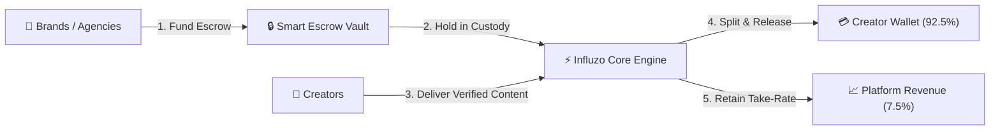
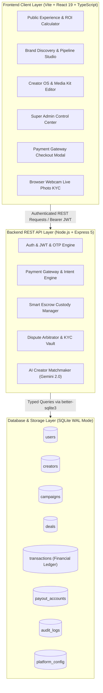
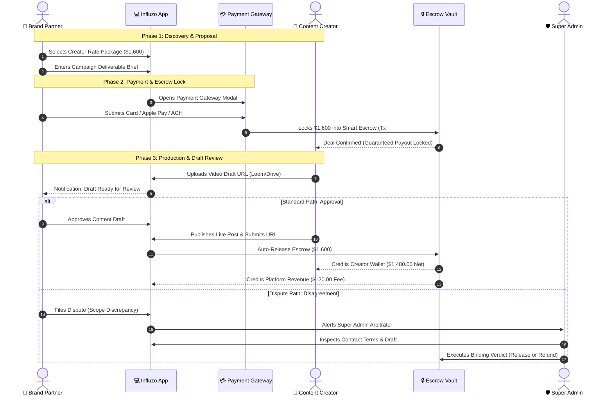
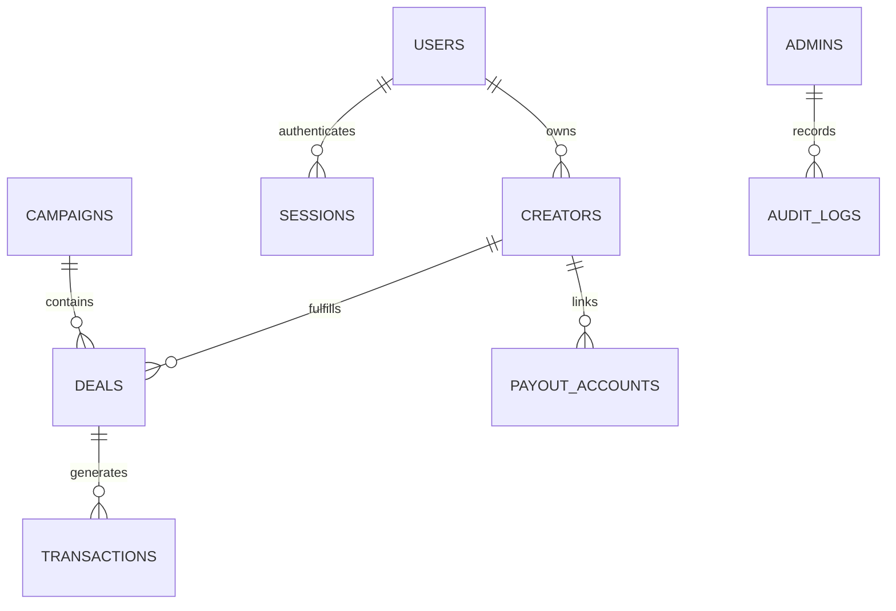

# 📖 Influzo — Complete System Architecture & Feature Documentation

> **Platform Version**: 2.0.0 (Production Market-Launch Architecture)  
> **Repository**: [`https://github.com/Souyash/INFLUZOO`](https://github.com/Souyash/INFLUZOO)  
> **Production Domain**: [`https://capitanissm.com`](https://capitanissm.com)  
> **Backend API**: Node.js / Express on Render (`http://localhost:5001` / `https://influzoo.onrender.com`)  
> **Frontend**: React 19 + TypeScript + Vite + Tailwind CSS v4 on Vercel  
> **Database**: SQLite WAL Relational Database (`server/src/data/influzo.db`)

---

## 📑 Table of Contents
1. [Executive Summary & Product Vision](#1-executive-summary--product-vision)
2. [Technical Architecture & Technology Stack](#2-technical-architecture--technology-stack)
3. [Complete Feature Inventory & Matrix](#3-complete-feature-inventory--matrix)
   - [A. Public Landing Page & Discovery](#a-public-landing-page--discovery)
   - [B. Authentication, Survey & Live Photo KYC](#b-authentication-survey--live-photo-kyc)
   - [C. Brand & Agency Studio](#c-brand--agency-studio)
   - [D. Payment Gateway & Escrow Checkout](#d-payment-gateway--escrow-checkout)
   - [E. Creator OS & Financial Wallet](#e-creator-os--financial-wallet)
   - [F. Super Admin Governance & Financial Command](#f-super-admin-governance--financial-command)
4. [End-to-End 5-Phase Deal Lifecycle](#4-end-to-end-5-phase-deal-lifecycle)
5. [SQLite Relational Database Schema & Data Models](#5-sqlite-relational-database-schema--data-models)
6. [Double-Entry Financial Ledger Engine](#6-double-entry-financial-ledger-engine)
7. [REST API Endpoint Directory](#7-rest-api-endpoint-directory)
8. [Master Credentials & Testing Reference](#8-master-credentials--testing-reference)

---

## 1. Executive Summary & Product Vision

**Influzo** is an AI-powered creator collaboration marketplace and smart escrow platform engineered to solve the two biggest pain points in influencer marketing:
1. **For Brands**: Eliminating payment fraud, fake follower inflation, and missed campaign deadlines through milestone-locked smart escrow and AI follower authenticity audits.
2. **For Creators**: Eliminating payment delays, endless unpaid revisions, and ghosting by guaranteeing 100% upfront escrow locking and zero-fee instant cash out.



---

## 2. Technical Architecture & Technology Stack



### Core Technologies:
- **Frontend**: React 19, TypeScript 5, Vite 8, Tailwind CSS v4, Lucide Icons, Recharts, Canvas-Confetti.
- **Backend**: Node.js v24, Express, `better-sqlite3` (operating in high-performance Write-Ahead Logging WAL mode), `bcryptjs`, `jsonwebtoken` (JWT), `cors`, `dotenv`.
- **Hosting & Infrastructure**:
  - **Frontend**: Vercel (connected via custom domain `capitanissm.com`).
  - **Backend**: Render Web Service.
  - **DNS**: Hostinger nameservers delegated to Vercel DNS (`ns1.vercel-dns.com`, `ns2.vercel-dns.com`).

---

## 3. Complete Feature Inventory & Matrix

### A. Public Landing Page & Discovery
- **Hero & Value Proposition**: High-conversion landing experience highlighting 0% creator fees, guaranteed escrow, and AI matchmaking.
- **Interactive ROI Calculator**: Dynamic sliders allowing brands to calculate estimated impressions, conversions, and expected ROAS based on campaign budget.
- **Creator Discovery Grid**: Searchable directory with real-time filtering by:
  - Content Niches (*Tech & AI, Beauty, Fitness, Gaming, Lifestyle, Fashion, Finance, Food*).
  - Primary Platform (*YouTube, TikTok, Instagram, Twitter/X, LinkedIn*).
  - Verified Creator Status Badge.
  - Full-text search by creator name, bio, or handle.
- **Creator Profile & Media Kit Modal**:
  - Audience demographic breakdowns (Age groups, Top countries, Gender distribution).
  - Performance statistics (On-time delivery %, completed collabs, average engagement rate).
  - Interactive Rate Packages with 1-click **"Hire / Send Offer"** trigger.
- **AI Matchmaking Modal**: Natural language search powered by Gemini API that parses brand briefs (e.g. *"Find a fitness creator in Austin under $1,200"*) and returns ranked creator matches.

---

### B. Authentication, Survey & Live Photo KYC
- **Dual Authentication Modes**:
  1. **Password Authentication**: Email + `bcryptjs` hashed passwords (salt rounds: 10) with persistent JWT session tokens.
  2. **6-Digit OTP Mode**: Ephemeral one-time passwords for instant passwordless verification.
- **Creator Profile Survey Onboarding Wizard**:
  - **Step 1 (Credentials)**: Full Name, Email, Password.
  - **Step 2 (Survey Data)**: Primary social handle `@handle`, City/Country, Pitch Bio, 1–3 Content Niches, Primary Platform & Follower count, Base Starting Rate ($).
  - **Step 3 (Browser Webcam Live Photo KYC)**:
    - Requests webcam access via `navigator.mediaDevices.getUserMedia`.
    - Live video stream with face alignment guide overlay.
    - 3-Second countdown snapshot trigger rendering directly to an HTML5 canvas.
    - Retake option, confirmation preview, and device fallback upload.
  - **Step 4 (Submission)**: Stores survey parameters and live selfie into SQLite database with status set to `pending`.
- **Dynamic Creator Dashboard Status Banner**:
  - `⏳ Review Pending`: Alert banner indicating live photo is being vetted by admin.
  - `✨ Verified Badge`: Active status indicator upon admin approval.
  - `⚠️ Verification Rejected`: Clear feedback reason from admin with 1-click re-submission.

---

### C. Brand & Agency Studio
- **Campaign Studio**: Declarative builder for creating brand campaign briefs with deliverables, budgets, target platforms, and deadlines.
- **Deal Proposal Pipeline (Kanban & Table)**:
  - Drag-and-drop / stage tracking of active creator contracts:
    - `Offer Sent` $\rightarrow$ `Escrow Locked` $\rightarrow$ `Draft Review` $\rightarrow$ `Live Verified` $\rightarrow$ `Completed`.
- **Deliverables Review System**:
  - Inspect creator-submitted video/media draft links (Loom, Drive, YouTube preview).
  - 1-Click **"Approve Draft & Release Escrow"**.
  - **"Request Revisions"** with actionable timecode notes.
  - **"File Escrow Dispute"** for immediate Super Admin arbitration.

---

### D. Payment Gateway & Escrow Checkout
- **Payment Gateway Modal (`PaymentGatewayModal.tsx`)**:
  - **Payment Options**:
    1. 💳 **Credit & Debit Cards** (with real card number formatting, MM/YY expiry, CVC, and ZIP validation).
    2. ⚡ **1-Click Express Checkout** (Apple Pay & Google Pay).
    3. 🏛️ **ACH / Wire Bank Transfer** for high-ticket campaigns ($5,000+).
  - **Itemized Financial Breakdown**:
    - Gross Deal Amount.
    - Platform Take-Rate % and Dollar Fee (e.g. 7.5%).
    - Net Creator Escrow Allocation (92.5%).
    - 100% Escrow Milestone Protection Guarantee.
  - **Live Processing & Receipt Generator**:
    - 3-Second bank clearance simulation.
    - Instant receipt download (`.txt` format) with unique `tx-xxxx` ID.
    - Automatic SQLite transaction ledger recording and escrow deal locking.

---

### E. Creator OS & Financial Wallet
- **Creator Overview Dashboard**: Total wallet balance, locked escrow funds, active deliverables, and performance rating.
- **Deals Inbox**: Real-time contract feed with deliverable requirements, brand briefs, and countdown deadlines.
- **Content Draft & Proof Submission**:
  - Submit draft media URL + notes for brand review.
  - Submit live public post URL (Instagram Reel / YouTube video / TikTok) for automated milestone release.
- **Media Kit & Rate Card Editor**: Live editor allowing creators to update packages, turnaround times, and prices with instant `PATCH /api/creators/:id` updates in SQLite.
- **Escrow Wallet & Payout Center**:
  - **Live Balances**: Available for Cash Out vs Locked in Milestone Escrow vs Lifetime Earned.
  - **Bank Account Linking Modal**: Add Bank Name, Account Number, Routing/IFSC, and Holder Name.
  - **1-Click Cash Out**: Instant withdrawal execution deducting from SQLite balance.
  - **Personal Transaction History Table**: Complete ledger of all deposits, releases, and withdrawals.

---

### F. Super Admin Governance & Financial Command
*(Accessible via discrete footer lock portal with master passkey `admin123`)*

- **Executive Financial Command**:
  - Real-time **Gross Marketplace Volume (GMV)**.
  - Total **Escrow in Custody ($)** currently locked.
  - Net **Platform Revenue ($)** earned from completed transaction fees.
  - Total Active Creators, Verified Count, and Disputed Volume.
- **Creator KYC & Live Selfie Verification Queue**:
  - Inspect all registered creators in SQLite.
  - **Live Selfie Photo Zoom Modal** to inspect live camera captures.
  - Review AI Follower Authenticity Audit score (bot risk analysis).
  - 1-Click **"Approve & Grant Verified Badge"** or **"Reject with Reason"**.
- **Escrow Dispute Arbitrator**:
  - View contested contracts with stated claims and uploaded drafts.
  - 1-Click **"Force Release to Creator"** (if contract scope was met).
  - 1-Click **"Full Refund to Brand"** (if deliverable was not provided).
- **Master Financial Transaction Ledger (`TransactionLedger.tsx`)**:
  - Searchable, filterable double-entry ledger of all platform transactions.
  - Filters by type (`deposit`, `release`, `withdrawal`).
  - 1-Click **CSV Export** for accounting and compliance.
- **Dynamic Platform Economics & Settings**:
  - Live **Platform Take-Rate Slider** (e.g. 5.0% – 15.0%).
  - Minimum Escrow Deposit limit ($).
  - Auto-release deadline window (Days).
  - AI Model router switch (Gemini 2.0 Flash / Pro).
  - Global Maintenance Mode toggle.
- **Immutable Compliance Audit Trail**:
  - Searchable activity stream tracking every login, escrow lock, payout, dispute verdict, and admin configuration change.

---

## 4. End-to-End 5-Phase Deal Lifecycle



---

## 5. SQLite Relational Database Schema & Data Models

The relational database is stored at `server/src/data/influzo.db` using WAL mode:

### Entity Relationship Diagram:



### Table Definitions:

```sql
-- 1. USERS
CREATE TABLE users (
  id TEXT PRIMARY KEY,
  email TEXT UNIQUE NOT NULL,
  password_hash TEXT,
  name TEXT NOT NULL,
  role TEXT NOT NULL, -- 'brand' | 'creator' | 'admin'
  avatar TEXT,
  onboarded INTEGER DEFAULT 1,
  creator_profile_id TEXT,
  brand_profile_id TEXT,
  created_at TEXT NOT NULL
);

-- 2. CREATORS
CREATE TABLE creators (
  id TEXT PRIMARY KEY,
  user_id TEXT,
  name TEXT NOT NULL,
  handle TEXT NOT NULL,
  avatar TEXT,
  cover_image TEXT,
  bio TEXT,
  location TEXT,
  verified INTEGER DEFAULT 0,
  verification_status TEXT DEFAULT 'pending', -- 'verified' | 'pending' | 'rejected'
  authenticity_score REAL DEFAULT 95.0,
  rating REAL DEFAULT 5.0,
  review_count INTEGER DEFAULT 0,
  niches TEXT NOT NULL, -- JSON array
  primary_platform TEXT NOT NULL,
  followers_count INTEGER NOT NULL,
  avg_engagement_rate REAL NOT NULL,
  avg_views_per_post INTEGER NOT NULL,
  price_range TEXT,
  platforms_json TEXT NOT NULL,
  audience_demographics_json TEXT NOT NULL,
  stats_json TEXT NOT NULL,
  sample_work_json TEXT NOT NULL,
  packages_json TEXT NOT NULL,
  featured INTEGER DEFAULT 0,
  kyc_photo TEXT, -- Base64 live webcam selfie
  kyc_submitted_at TEXT,
  kyc_reviewed_at TEXT,
  kyc_rejection_reason TEXT,
  wallet_available REAL DEFAULT 0,
  wallet_locked REAL DEFAULT 0,
  wallet_earned REAL DEFAULT 0,
  created_at TEXT NOT NULL
);

-- 3. CAMPAIGNS
CREATE TABLE campaigns (
  id TEXT PRIMARY KEY,
  brand_id TEXT,
  title TEXT NOT NULL,
  brand_name TEXT NOT NULL,
  brand_logo TEXT,
  niche TEXT NOT NULL,
  status TEXT NOT NULL, -- 'active' | 'draft' | 'completed'
  total_budget REAL NOT NULL,
  allocated_budget REAL DEFAULT 0,
  creators_target_count INTEGER NOT NULL,
  creators_hired_count INTEGER DEFAULT 0,
  deliverables_summary TEXT,
  deadline TEXT NOT NULL,
  target_platforms_json TEXT NOT NULL,
  metrics_json TEXT NOT NULL,
  created_at TEXT NOT NULL
);

-- 4. DEALS
CREATE TABLE deals (
  id TEXT PRIMARY KEY,
  campaign_id TEXT,
  campaign_title TEXT NOT NULL,
  brand_name TEXT NOT NULL,
  brand_logo TEXT,
  creator_id TEXT NOT NULL,
  creator_name TEXT NOT NULL,
  creator_handle TEXT NOT NULL,
  creator_avatar TEXT,
  platform TEXT NOT NULL,
  package_title TEXT NOT NULL,
  amount REAL NOT NULL,
  escrow_status TEXT NOT NULL, -- 'pending_deposit' | 'escrow_locked' | 'draft_submitted' | 'approved' | 'released' | 'disputed'
  stage TEXT NOT NULL, -- 'offer_sent' | 'accepted' | 'draft_review' | 'live_verified' | 'completed'
  deliverables_json TEXT NOT NULL,
  brief_notes TEXT,
  draft_notes TEXT,
  draft_media_url TEXT,
  live_post_url TEXT,
  dispute_reason TEXT,
  dispute_opened_at TEXT,
  arbitration_verdict TEXT,
  created_at TEXT NOT NULL,
  deadline TEXT NOT NULL,
  completed_at TEXT
);

-- 5. TRANSACTIONS (Financial Ledger)
CREATE TABLE transactions (
  id TEXT PRIMARY KEY,
  deal_id TEXT,
  type TEXT NOT NULL, -- 'deposit' | 'release' | 'platform_fee' | 'withdrawal' | 'refund'
  amount REAL NOT NULL,
  platform_fee REAL DEFAULT 0,
  net_amount REAL NOT NULL,
  currency TEXT DEFAULT 'USD',
  payment_method TEXT NOT NULL, -- 'stripe_card' | 'apple_pay' | 'google_pay' | 'bank_transfer' | 'escrow_wallet'
  payment_intent_id TEXT,
  status TEXT NOT NULL, -- 'succeeded' | 'pending' | 'failed'
  payer_name TEXT NOT NULL,
  recipient_name TEXT NOT NULL,
  created_at TEXT NOT NULL
);

-- 6. PAYOUT_ACCOUNTS
CREATE TABLE payout_accounts (
  id TEXT PRIMARY KEY,
  creator_id TEXT NOT NULL,
  bank_name TEXT NOT NULL,
  account_number_masked TEXT NOT NULL,
  routing_number TEXT NOT NULL,
  account_holder_name TEXT NOT NULL,
  currency TEXT DEFAULT 'USD',
  is_default INTEGER DEFAULT 1,
  created_at TEXT NOT NULL
);

-- 7. AUDIT_LOGS
CREATE TABLE audit_logs (
  id TEXT PRIMARY KEY,
  action TEXT NOT NULL,
  entity_type TEXT NOT NULL,
  entity_id TEXT NOT NULL,
  details TEXT NOT NULL,
  actor TEXT NOT NULL,
  timestamp TEXT NOT NULL
);

-- 8. PLATFORM_CONFIG
CREATE TABLE platform_config (
  key TEXT PRIMARY KEY,
  value TEXT NOT NULL
);

-- 9. OTP_CODES
CREATE TABLE otp_codes (
  email_or_phone TEXT PRIMARY KEY,
  code TEXT NOT NULL,
  role TEXT NOT NULL,
  expires_at INTEGER NOT NULL
);
```

---

## 6. Double-Entry Financial Ledger Engine

Whenever funds move on Influzo, the backend records an immutable transaction entry:

| Transaction Type | Trigger Action | Amount Gross | Platform Fee Cut | Net Amount | Payer | Recipient |
| :--- | :--- | :--- | :--- | :--- | :--- | :--- |
| **`deposit`** | Brand pays via Payment Gateway | `$1,600` | `$120` (7.5%) | `$1,480` (Allocated) | Brand Partner | Smart Escrow Vault |
| **`release`** | Brand approves live post | `$1,600` | `$120` (Retained) | `$1,480` (Credited) | Escrow Custody | Creator Wallet |
| **`withdrawal`** | Creator transfers to bank | `$1,000` | `$0` (0% Fee) | `$1,000` | Creator Wallet | Chase Bank (•••• 4821) |
| **`refund`** | Admin refunds disputed deal | `$1,600` | `$0` | `$1,600` | Escrow Custody | Brand Partner |

---

## 7. REST API Endpoint Directory

### Authentication & KYC
- `POST /api/auth/signup`: Password registration for Brands and standard users.
- `POST /api/auth/creator-signup-survey`: Unified registration with profile survey + live webcam photo KYC.
- `POST /api/auth/login`: Email and password authentication with JWT return.
- `GET /api/auth/me`: Decodes Bearer JWT and loads live user and creator record.
- `POST /api/auth/send-otp` & `POST /api/auth/verify-otp`: 6-Digit OTP verification.
- `POST /api/auth/admin-login`: Super Admin authentication via master passkey.

### Marketplace & Creators
- `GET /api/creators`: Search and filter creators by niche, platform, verification status, and query.
- `GET /api/creators/:id`: Retrieve full media kit and performance statistics.
- `PATCH /api/creators/:id`: Live media kit and rate package updates.

### Campaigns & Deals
- `GET /api/campaigns` & `POST /api/campaigns`: Brand campaign briefs.
- `GET /api/deals` & `POST /api/deals`: Deal contracts and proposals.
- `POST /api/deals/:id/draft`: Creator content draft submission.
- `POST /api/deals/:id/live-post`: Creator live post URL proof submission.

### Payments & Escrow
- `POST /api/payments/create-intent`: Prepare payment intent with take-rate calculation.
- `POST /api/payments/confirm-deposit`: Verify payment, lock funds in escrow, and record in ledger.
- `POST /api/payments/withdraw`: Creator 1-click bank cash out.
- `GET /api/payments/transactions`: Real-time transaction ledger.
- `GET /api/payments/payout-methods` & `POST /api/payments/payout-methods`: Creator bank accounts.
- `POST /api/escrow/release`: Auto-release escrow upon deliverable approval.
- `POST /api/escrow/dispute`: Open dispute for Super Admin arbitration.

### Super Admin Control
- `GET /api/admin/overview`: Executive metrics (GMV, Custody, Revenue, KYC queue).
- `POST /api/admin/verify-creator`: Approve/Reject creator KYC with custom feedback.
- `POST /api/admin/arbitrate-dispute`: Execute binding verdict on contested contracts.
- `PATCH /api/admin/config`: Update live take-rate %, deposit minimums, and AI router.
- `GET /api/admin/audit-logs`: Full compliance audit trail.

---

## 8. Master Credentials & Testing Reference

| Role | Username / Email | Password / Passkey | Capabilities |
| :--- | :--- | :--- | :--- |
| **🛡️ Super Admin** | `admin@influzo.com` (or Portal) | **`admin123`** | KYC Vetting, Financial Ledger, Dispute Arbitrator, Platform Fee Slider, Audit Trail |
| **🎨 Demo Creator** | `elena@techreviews.com` | `password123` | Media Kit, Deals Inbox, Draft & Live Post Submitter, Bank Cash Out Wallet |
| **🏢 Demo Brand** | `growth@taskflow.ai` | `password123` | Campaign Studio, Creator Discovery, Payment Gateway Escrow Funding |
| **💳 Test Payment Cards** | `4242 •••• •••• 4242` | Expiry `08/29` • CVC `888` | Instant Escrow Deposit Verification |

---

*Documentation compiled and maintained for Influzo Market Launch Architecture.*
